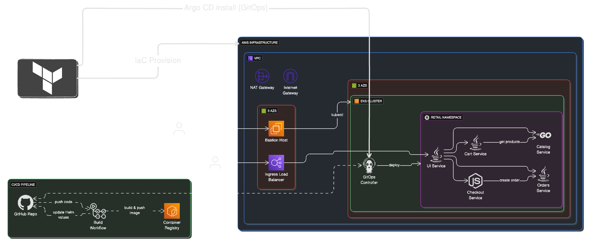
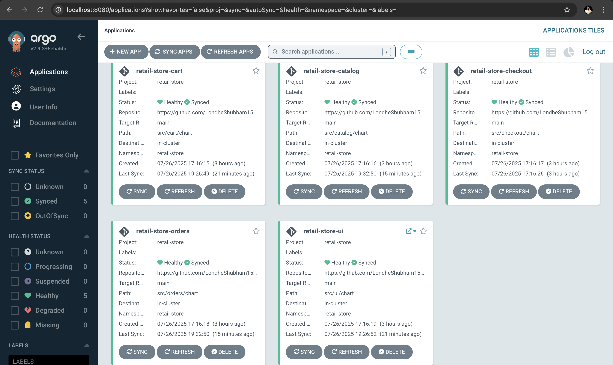

# Retail Store Sample App - GitOps with Amazon EKS Auto Mode


<div align="center">
  <div align="center">

[](Stars)


  </div>

  <strong>
  <h2>AWS Containers Retail Sample</h2>
  </strong>
</div>

> **🚀 DEPLOYMENT READY:** All configurations validated and updated. Run `terraform apply` without any manual fixes! See [DEPLOYMENT_READY.md](DEPLOYMENT_READY.md) for details.

This is a sample application designed to illustrate various concepts related to containers on AWS. It presents a sample retail store application including a product catalog, shopping cart and checkout, deployed using modern DevOps practices including GitOps and Infrastructure as Code.

## 📋 Quick Links

- **[DEPLOYMENT_READY.md](DEPLOYMENT_READY.md)** - Start here for deployment
- **[CONFIGURATION_SUMMARY.md](CONFIGURATION_SUMMARY.md)** - All configuration changes
- **[terraform/VALIDATED_CONFIGURATION.md](terraform/VALIDATED_CONFIGURATION.md)** - Detailed validation
- **[validate-terraform-config.sh](validate-terraform-config.sh)** - Configuration validator

## Table of Contents

- [Overview](#overview)
- [Architecture](#architecture)
- [Prerequisites](#prerequisites)
- [Quick Start](#quick-start)
- [Branch Strategy](#branch-strategy)
- [Getting Started](#getting-started)
- [GitOps Workflow](#gitops-workflow)
- [EKS Auto Mode](#eks-auto-mode)
- [Infrastructure Components](#infrastructure-components)
- [CI/CD Pipeline](#cicd-pipeline)
- [Monitoring and Observability](#monitoring-and-observability)
- [Cleanup](#cleanup)
- [Troubleshooting](#troubleshooting)

## Overview

The Retail Store Sample App demonstrates a modern microservices architecture deployed on AWS EKS using GitOps principles. The application consists of multiple services that work together to provide a complete retail store experience:


- **UI Service**: Java-based frontend
- **Catalog Service**: Go-based product catalog API
- **Cart Service**: Java-based shopping cart API
- **Orders Service**: Java-based order management API
- **Checkout Service**: Node.js-based checkout orchestration API

## Infrastructure Architecture



The Infrastructure Architecture follows cloud-native best practices:

- **Microservices**: Each component is developed and deployed independently
- **Containerization**: All services run as containers on Kubernetes
- **GitOps**: Infrastructure and application deployment managed through Git
- **Infrastructure as Code**: All AWS resources defined using Terraform
- **CI/CD**: Automated build and deployment pipelines with GitHub Actions

## Application Architecture

The application has been deliberately over-engineered to generate multiple de-coupled components. These components generally have different infrastructure dependencies, and may support multiple "backends" (example: Carts service supports MongoDB or DynamoDB).


| Component                  | Language | Container Image                                                             | Helm Chart                                                                        | Description                             |
| -------------------------- | -------- | --------------------------------------------------------------------------- | --------------------------------------------------------------------------------- | --------------------------------------- |
| [UI](./src/ui/)            | Java     | [Link](https://gallery.ecr.aws/aws-containers/retail-store-sample-ui)       | [Link](https://gallery.ecr.aws/aws-containers/retail-store-sample-ui-chart)       | Store user interface                    |
| [Catalog](./src/catalog/)  | Go       | [Link](https://gallery.ecr.aws/aws-containers/retail-store-sample-catalog)  | [Link](https://gallery.ecr.aws/aws-containers/retail-store-sample-catalog-chart)  | Product catalog API                     |
| [Cart](./src/cart/)        | Java     | [Link](https://gallery.ecr.aws/aws-containers/retail-store-sample-cart)     | [Link](https://gallery.ecr.aws/aws-containers/retail-store-sample-cart-chart)     | User shopping carts API                 |
| [Orders](./src/orders)     | Java     | [Link](https://gallery.ecr.aws/aws-containers/retail-store-sample-orders)   | [Link](https://gallery.ecr.aws/aws-containers/retail-store-sample-orders-chart)   | User orders API                         |
| [Checkout](./src/checkout) | Node     | [Link](https://gallery.ecr.aws/aws-containers/retail-store-sample-checkout) | [Link](https://gallery.ecr.aws/aws-containers/retail-store-sample-checkout-chart) | API to orchestrate the checkout process |


## Quick Start

**Want to deploy immediately?** Follow these steps for a basic deployment:

1. **Install Prerequisites**: AWS CLI, Terraform, kubectl, Docker, Helm
2. **Configure AWS**: `aws configure` with appropriate credentials
3. **Clone Repository**: `git clone https://github.com/arumullayaswanth/k8s-microservices-ecommerce-app.git`
4. **Deploy Infrastructure**: Run Terraform in two phases (see [Getting Started](#getting-started))
5. **Access Application**: Get load balancer URL and browse the retail store

**Need advanced GitOps workflow?** See [BRANCHING_STRATEGY.md](./BRANCHING_STRATEGY.md) for automated CI/CD setup.

## Branch Strategy

This repository uses a **dual-branch approach** for different deployment scenarios:

###  **Public Application (Main Branch)**
- **Purpose**: Simple deployment with public images
- **Images**: Public ECR (stable versions like v1.2.2)
- **Deployment**: Manual control with umbrella chart
- **Updates**: Manual only
- **Best for**: Demos, learning, quick testing, simple deployments

###  **Production (GitOps Branch)**
- **Purpose**: Full production workflow with CI/CD pipeline
- **Images**: Private ECR (auto-updated with commit hashes)
- **Deployment**: Automated via GitHub Actions
- **Updates**: Automatic on code changes
- **Best for**: Production environments, automated workflows, enterprise deployments

> ** For detailed branching strategy, CI/CD setup, and advanced workflows, see [BRANCHING_STRATEGY.md](./BRANCHING_STRATEGY.md)**

## Prerequisites

Before you begin, ensure you have the following tools installed:

- **AWS CLI** (configured with appropriate credentials)
- **Terraform** (version 1.0.0 or later)
- **kubectl** (compatible with Kubernetes 1.23+)
- **Git** (2.0.0 or later)
- **Docker** (for local development)
- **Helm** 

## Getting Started

Follow these steps to **install Prerequisites:**

- #### 1. AWS CLI:

  * These commands will download and install the **AWS Command Line Interface**.

```sh
curl "https://awscli.amazonaws.com/awscli-exe-linux-x86_64.zip" -o "awscliv2.zip"
unzip awscliv2.zip
sudo ./aws/install

# Verify the installation
aws --version
```

- #### 2. Terraform:

  - **Terraform** is installed by downloading the binary appropriate for your operating system.

    - <details>
      <summary><strong>Click for Linux & macOS Instructions</strong></summary>

      1.  **Download the Binary**: Go to the [Terraform Downloads Page](https://releases.hashicorp.com/terraform/1.12.2) to find the correct zip file for your system (e.g., Linux AMD64, macOS ARM64).

      2.  **Install the Binary**: Unzip the file and move the `terraform` executable to a directory in your system's PATH.

        ```sh
        # Example for a downloaded file
        unzip terraform_1.9.0_linux_amd64.zip
        sudo mv terraform /usr/local/bin/
        ```
        or
        ```sh
        # Example for macOS
        brew install terraform
        ```
      3.  **Verify the Installation**:
     
        ```sh
        terraform --version
        ```
      </details>
  
    - <details>
      <summary><strong>Click for Windows Instructions</strong></summary>
  
        * **Official Guide:** [Install Terraform on Windows](https://developer.hashicorp.com/terraform/install)
    
      </details>

- #### 3. kubectl:

  * These commands install a specific version of **kubectl**.

    - <details>
      <summary><strong>Click for macOS Instructions</strong></summary>
  
        ```sh
        # Download the kubectl binary
        curl -LO "https://dl.k8s.io/release/v1.33.3/bin/darwin/arm64/kubectl"

        # Make the binary executable
        chmod +x ./kubectl

          # Move the binary into your PATH
        sudo mv ./kubectl /usr/local/bin/kubectl
        ```

      </details>

    - <details>
      <summary><strong>Click for Linux Instructions</strong></summary>
  
      ```sh
      # Download the kubectl binary
      curl -LO "https://dl.k8s.io/release/v1.33.3/bin/linux/amd64/kubectl"
  
      # Make the binary executable
      chmod +x ./kubectl

      # Move the binary into your PATH
      sudo mv ./kubectl /usr/local/bin/kubectl
      ```
      
      </details>

- #### [4. Docker](https://docs.docker.com/desktop/setup/install/linux/):

  - > **Step 1: Set Up the Repository:**

    ```sh
    sudo apt-get update
    sudo apt-get install \
        ca-certificates \
        curl \
        gnupg
    ```

  - > **Step 2: Add Docker’s Official GPG Key:**

    ```sh
    sudo install -m 0755 -d /etc/apt/keyrings
    curl -fsSL https://download.docker.com/linux/ubuntu/gpg | sudo gpg --dearmor -o /etc/apt/keyrings/docker.gpg
    sudo chmod a+r /etc/apt/keyrings/docker.gpg
    ```
  
  - > **Step 3: Set Up the Docker Repository:**

    ```sh
    echo \
      "deb [arch=$(dpkg --print-architecture) signed-by=/etc/apt/keyrings/docker.gpg] https://download.docker.com/linux/ubuntu \
      $(. /etc/os-release && echo "$VERSION_CODENAME") stable" | \
      sudo tee /etc/apt/sources.list.d/docker.list > /dev/null
    ```


  - > **Step 4: Install Docker Engine:**
    
    ```sh
    sudo apt-get update
    sudo apt-get install docker-ce docker-ce-cli containerd.io docker-buildx-plugin docker-compose-plugin

    # Verify the installation
    docker --version
    ```

- #### 5. Helm:
  
    ```sh
    curl -fsSL -o get_helm.sh https://raw.githubusercontent.com/helm/helm/main/scripts/get-helm-3
    chmod 700 get_helm.sh
    ./get_helm.sh --version v3.18.4
    ```


Follow these steps to deploy the application:

### Step 1. Configure AWS with **`Root User`** Credentials:

  Ensure your AWS CLI is configured with the **Root user credentials:**

```sh
aws configure
```

### Step 2. Clone the Repository:

```sh
git clone https://github.com/arumullayaswanth/k8s-microservices-ecommerce-app.git
cd k8s-microservices-ecommerce-app.git
```

> [!IMPORTANT]
> ### Step 3: Choose Your Deployment Strategy
>
> **For Public Application (Main Branch):**
> - Uses stable public ECR images (v1.2.2)
> - Manual deployment control
> - No GitHub Actions required
> - Skip to Step 4 - infrastructure is ready
>
> **For Production (GitOps Branch):**
> - Uses private ECR with automated CI/CD
> - Requires GitHub Actions setup
> - See [BRANCHING_STRATEGY.md](./BRANCHING_STRATEGY.md) for complete setup
>
> ### GitHub Actions Setup (Production Branch Only):
> 
> If using the Production branch, configure these secrets in your GitHub repository:
> 
> | Secret Name           | Value                              |
> |-----------------------|------------------------------------|
> | `AWS_ACCESS_KEY_ID`   | `Your AWS Access Key ID`           |
> | `AWS_SECRET_ACCESS_KEY` | `Your AWS Secret Access Key`     |
> | `AWS_REGION`          | `region-name`                       |
> | `AWS_ACCOUNT_ID`        | `your-account-id` |


### Step 4. Deploy Infrastructure with Terraform:

The deployment is split into two phases for better control:


### Phase 1 of Terraform: Create EKS Cluster 

In Phase 1: Terraform Initialises and creates resources within the retail_app_eks module. 

```sh
cd k8s-microservices-ecommerce-app.git/terraform/
terraform init
terraform apply -target=module.retail_app_eks -target=module.vpc --auto-approve
```


This creates the core infrastructure, including:
- VPC with public and private subnets
- Amazon EKS cluster with Auto Mode enabled
- Security groups and IAM roles
  

### Step 6: Update kubeconfig to Access the Amazon EKS Cluster:
```
aws eks update-kubeconfig --name retail-store --region <region>
```

### Phase 2 of Terraform: Once you update kubeconfig, apply the Remaining Configuration:


```bash
terraform apply --auto-approve
```

This deploys:
- ArgoCD for Setup GitOps
- NGINX Ingress Controller
- Cert Manager for SSL certificates

### Step 7: GitHub Actions (Production Branch Only)

> **Note**: This step is only required if you're using the **Production branch** for automated deployments. Skip this step if using the **Public Application branch** for simple deployment.

For GitHub Actions, first configure secrets so the pipelines can be automatically triggered:

**Create an IAM User, policies, and generate credentials**

**Go to your GitHub repo → Settings → Secrets and variables → Actions → New repository secret.**


| Secret Name           | Value                              |
|-----------------------|------------------------------------|
| `AWS_ACCESS_KEY_ID`   | `Your AWS Access Key ID`           |
| `AWS_SECRET_ACCESS_KEY` | `Your AWS Secret Access Key`     |
| `AWS_REGION`          | `region-name`                       |
| `AWS_ACCOUNT_ID`        | `your-account-id` |


> [!IMPORTANT]
> Once the entire cluster is created, any changes pushed to the repository will automatically trigger GitHub Actions.

GitHub Actions will automatically build and push the updated Docker images to Amazon ECR.


### Verify Deployment

Check if the nodes are running:

```bash
kubectl get nodes
```

### Step 8: Access the Application:

The application is exposed through the NGINX Ingress Controller. Get the load balancer URL:

```bash
kubectl get svc -n ingress-nginx
```

Use the EXTERNAL-IP of the ingress-nginx-controller service to access the application.


### Step 9: Argo CD Automated Deployment:

**Verify ArgoCD installation**

```
kubectl get pods -n argocd
```


### Step 10: Port-forward to Argo CD UI and login:

**Get ArgoCD admin password**
```
kubectl -n argocd get secret argocd-initial-admin-secret -o jsonpath='{.data.password}' | base64 -d
```

**Port-forward to Argo CD UI**
```
kubectl port-forward svc/argocd-server -n argocd 8080:443 &
```

Open your browser and navigate to:
https://localhost:8080

Username: admin 

Password: <output of previous command>

### Step 10: Access ArgoCD UI

Once ArgoCD is deployed, you can access the web interface:



The ArgoCD UI provides:
- **Application Status**: Real-time sync status of all services
- **Resource View**: Detailed view of Kubernetes resources
- **Sync Operations**: Manual sync and rollback capabilities
- **Health Monitoring**: Application and resource health status

### Step 11: Monitor Application Deployment

```bash
kubectl get pods -n retail-store
kubectl get ingress -n retail-store
```

### Step 12: Cleanup

To delete all resources created by Terraform:


**For Phase 1: Run this command**

```bash
terraform destroy -target=module.retail_app_eks --auto-approve
```

**For Phase 2: Run this command**
```
terraform destroy --auto-approve
```


> [!NOTE]
> Only ECR Repositories you need to Delete it from AWS Console Manually.


## Troubleshooting

### Common Issues

#### **Image Pull Errors**
```
Error: Failed to pull image "123456789012.dkr.ecr.us-east-1.amazonaws.com/retail-store-ui:abc1234"
```
**Solutions**:
1. Ensure you're using the correct branch for your deployment strategy
2. For Production branch: Check GitHub Actions completed successfully
3. For Public Application branch: Verify you're using public ECR images
4. Check AWS credentials and ECR permissions

#### **Monitoring Services Not Accessible**
**Solutions**:
1. Verify security groups allow ports 9090 and 9093
2. Check LoadBalancer status: `kubectl get svc -n monitoring`
3. Wait 2-3 minutes for LoadBalancers to provision
4. See [MONITORING_FIX_GUIDE.md](MONITORING_FIX_GUIDE.md) for detailed troubleshooting

#### **Application Not Accessible**
**Solutions**:
1. Check NGINX Ingress Controller: `kubectl get pods -n ingress-nginx`
2. Verify LoadBalancer: `kubectl get svc -n ingress-nginx`
3. Check ArgoCD sync status: `kubectl get applications -n argocd`
4. Run diagnostics: `./diagnose-application.sh`

#### **GitHub Actions Not Triggering**
**Solutions**:
1. Ensure changes are in `src/` directory
2. Verify you're on the `production` branch (gitops)
3. Check GitHub Actions is enabled in repository settings
4. Review [BRANCHING_STRATEGY.md](./BRANCHING_STRATEGY.md) for detailed setup

### Validation and Diagnostics

**Validate Configuration:**
```bash
./validate-terraform-config.sh
```

**Check Application Status:**
```bash
./check-application-access.sh
```

**Full Diagnostics:**
```bash
./diagnose-application.sh
./diagnose-monitoring.sh
```

### Getting Help

- **Deployment issues**: See [DEPLOYMENT_READY.md](DEPLOYMENT_READY.md)
- **Configuration changes**: See [CONFIGURATION_SUMMARY.md](CONFIGURATION_SUMMARY.md)
- **Advanced GitOps**: See [BRANCHING_STRATEGY.md](./BRANCHING_STRATEGY.md)
- **Infrastructure issues**: Review Terraform logs
- **Application issues**: Check ArgoCD UI and kubectl logs

## CI/CD Pipeline

This project supports multiple CI/CD approaches with full automation:

### GitHub Actions (Recommended)

Two automated workflows are provided for complete CI/CD:

#### 1. Infrastructure Deployment (`terraform-deploy.yml`)

**Triggers:**
- Push to `main` branch (terraform/** or src/** changes)
- Pull requests to `main` (terraform/** changes)
- Manual workflow dispatch

**Features:**
- ✅ Automated validation and formatting checks
- ✅ Terraform plan on pull requests
- ✅ Phased deployment (VPC → EKS → Add-ons)
- ✅ Post-deployment verification
- ✅ Service URL extraction and reporting
- ✅ Deployment summary in GitHub
- ✅ Optional Slack notifications
- ✅ Manual destroy option

**Required Secrets:**
```yaml
AWS_ACCESS_KEY_ID: Your AWS access key
AWS_SECRET_ACCESS_KEY: Your AWS secret key
AWS_ACCOUNT_ID: Your AWS account ID (for ECR)
SLACK_WEBHOOK: (Optional) Slack webhook URL
```

**Workflow Jobs:**
1. **Validate** - Format check, validation, config validation
2. **Plan** - Terraform plan (on PRs)
3. **Deploy** - Full infrastructure deployment
4. **Destroy** - Infrastructure teardown (manual only)

#### 2. Service Deployment (`service-deploy.yml`)

**Triggers:**
- Push to `main` branch (src/** changes)
- Manual workflow dispatch

**Features:**
- ✅ Intelligent change detection (builds only changed services)
- ✅ Parallel builds for multiple services
- ✅ Automatic ECR push with commit hash tags
- ✅ ArgoCD sync trigger
- ✅ Deployment summary

**Services Supported:**
- UI (Java/Spring Boot)
- Catalog (Go)
- Cart (Java/Spring Boot)
- Checkout (Node.js/NestJS)
- Orders (Java/Spring Boot)

**Workflow:**
1. Detect which services changed
2. Build Docker images in parallel
3. Push to private ECR with tags (commit hash + latest)
4. Trigger ArgoCD sync for updated services

### Setup GitHub Actions

1. **Add Repository Secrets:**
   ```
   Settings → Secrets and variables → Actions → New repository secret
   ```
   Add:
   - `AWS_ACCESS_KEY_ID`
   - `AWS_SECRET_ACCESS_KEY`
   - `AWS_ACCOUNT_ID`
   - `SLACK_WEBHOOK` (optional)

2. **Enable GitHub Actions:**
   ```
   Settings → Actions → General → Allow all actions
   ```

3. **Configure Environments (Optional):**
   ```
   Settings → Environments → New environment
   ```
   Create `production` and `production-destroy` environments with protection rules

4. **Push to Main:**
   ```bash
   git add .
   git commit -m "Enable GitHub Actions"
   git push origin main
   ```

### Workflow Examples

**Deploy Infrastructure:**
```bash
# Automatic on push to main
git push origin main

# Or manual via GitHub UI
Actions → Terraform Deploy to EKS → Run workflow → Select 'apply'
```

**Deploy Services:**
```bash
# Automatic when service code changes
git add src/ui/
git commit -m "Update UI service"
git push origin main

# Or manual via GitHub UI
Actions → Build and Deploy Services → Run workflow
```

**Destroy Infrastructure:**
```bash
# Manual only via GitHub UI
Actions → Terraform Deploy to EKS → Run workflow → Select 'destroy'
```

### GitHub Actions Output

After successful deployment, you'll see:

**Deployment Summary:**
- ✅ Service URLs (Application, Grafana, Prometheus, ArgoCD)
- ✅ Credentials
- ✅ Deployed components list
- ✅ Cluster information

**Pull Request Comments:**
- 📖 Terraform plan output
- 📊 Resource changes summary

### Jenkins Pipeline (Alternative)

An enhanced Jenkins pipeline is provided in `terraform/jenkins` with the following features:

**Features:**
- ✅ Automated validation before deployment
- ✅ Phased deployment (VPC → EKS → Add-ons)
- ✅ Post-deployment verification
- ✅ Proper cleanup on destroy
- ✅ Monitoring stack toggle
- ✅ Region configuration (us-east-1)
- ✅ Error handling and logging

**Pipeline Parameters:**
- `ACTION`: Choose between `apply` or `destroy`
- `ENABLE_MONITORING`: Toggle monitoring stack (Prometheus, Grafana, Alertmanager)
- `SKIP_VALIDATION`: Skip pre-deployment validation (not recommended)

**Usage:**
1. Configure Jenkins with AWS credentials
2. Create a new Pipeline job
3. Point to `terraform/jenkins` file
4. Run with desired parameters

**Pipeline Stages:**
1. Checkout from Git
2. Pre-deployment Validation (optional)
3. Upgrade Tools (AWS CLI, kubectl, Terraform)
4. Terraform Init & Validate
5. Terraform Plan
6. Targeted Apply: VPC
7. Targeted Apply: EKS Cluster
8. Update kubeconfig
9. Final Apply: Add-ons & Applications
10. Post-Deployment Verification

**For Destroy:**
1. Pre-Destroy Cleanup (ArgoCD apps, LoadBalancers)
2. Terraform Destroy

### GitHub Actions (GitOps Branch)

For automated CI/CD with GitHub Actions, see the `gitops` branch and [BRANCHING_STRATEGY.md](./BRANCHING_STRATEGY.md).

**Features:**
- Automated builds on code changes
- Private ECR image management
- Automatic Helm chart updates
- ArgoCD auto-sync

### Manual Deployment

For manual deployment using Terraform directly:

```bash
# Validate configuration
./validate-terraform-config.sh

# Deploy
cd terraform
terraform init
terraform apply -auto-approve
```

See [DEPLOYMENT_READY.md](DEPLOYMENT_READY.md) for detailed manual deployment instructions.

## Monitoring and Observability

The infrastructure includes a complete monitoring stack with properly configured LoadBalancers:

### Components

**Prometheus**
- Metrics collection and storage
- Accessible via LoadBalancer on port 9090
- Health check path: `/-/healthy`
- No authentication (add for production)

**Grafana**
- Visualization and dashboards
- Accessible via LoadBalancer on port 80
- Default credentials: admin/admin123 (change in production!)
- Pre-configured Prometheus datasource

**Alertmanager**
- Alert management and routing
- Accessible via LoadBalancer on port 9093
- Health check path: `/-/healthy`
- No authentication (add for production)

### Access Monitoring Services

After deployment, get the URLs:

```bash
# Grafana
echo "http://$(kubectl get svc kube-prometheus-stack-grafana -n monitoring -o jsonpath='{.status.loadBalancer.ingress[0].hostname}')"

# Prometheus
echo "http://$(kubectl get svc kube-prometheus-stack-prometheus -n monitoring -o jsonpath='{.status.loadBalancer.ingress[0].hostname}'):9090"

# Alertmanager
echo "http://$(kubectl get svc kube-prometheus-stack-alertmanager -n monitoring -o jsonpath='{.status.loadBalancer.ingress[0].hostname}'):9093"
```

### Configuration

All monitoring LoadBalancers are configured with:
- Type: `external` (AWS Load Balancer Controller format)
- Target Type: `ip` (for EKS Auto Mode compatibility)
- Scheme: `internet-facing`
- Health checks: Configured for each service

### Security Groups

The following ports are configured in security groups:
- Port 80 (HTTP) - Application and Grafana
- Port 443 (HTTPS) - ArgoCD and secure services
- Port 9090 (Prometheus) - Metrics
- Port 9093 (Alertmanager) - Alerts

### Disabling Monitoring

To disable monitoring and reduce costs:

**In Terraform:**
```hcl
# terraform/terraform.tfvars
enable_monitoring = false
```

**In Jenkins:**
- Uncheck `ENABLE_MONITORING` parameter when running pipeline

## Recent Configuration Updates

### Version 1.2 (Current - Production Ready)

**Region Migration:**
- Changed default region from us-west-2 to us-east-1
- Updated all documentation and examples

**Security Groups:**
- Added port 9090 for Prometheus
- Added port 9093 for Alertmanager
- All required ports now configured

**Monitoring LoadBalancers:**
- Updated to AWS Load Balancer Controller format
- Changed from "nlb" to "external" type
- Added "ip" target type for EKS Auto Mode
- Added health check paths for all services
- Fixed Grafana datasource duplicate issue

**Jenkins Pipeline:**
- Added pre-deployment validation
- Added post-deployment verification
- Added monitoring toggle parameter
- Enhanced error handling and logging
- Added proper cleanup on destroy

**GitHub Actions:**
- Complete CI/CD automation
- Infrastructure deployment workflow
- Service build and deployment workflow
- Intelligent change detection
- ArgoCD integration

**Terraform Destroy:**
- Added automatic cleanup for Helm releases
- Added finalizer removal for stuck resources
- Added webhook cleanup
- Added LoadBalancer cleanup
- Created manual cleanup script for edge cases

**Documentation:**
- Created comprehensive deployment guides
- Added validation scripts
- Added troubleshooting guides
- Updated all region references

For complete change history, see [terraform/CHANGELOG.md](terraform/CHANGELOG.md).

## Cleanup and Destroy

### Normal Destroy

```bash
cd terraform
terraform destroy -auto-approve
```

The destroy process now includes automatic cleanup of:
- ArgoCD applications and CRDs
- Cert-manager certificates and webhooks
- LoadBalancer services
- Monitoring stack resources
- Namespace finalizers

### If Destroy Gets Stuck

If Helm releases get stuck during destroy (timeout errors), run the cleanup script:

```bash
# Make script executable
chmod +x cleanup-stuck-resources.sh

# Run cleanup
./cleanup-stuck-resources.sh

# Then retry destroy
cd terraform
terraform destroy -auto-approve
```

The cleanup script will:
1. Remove all finalizers from resources
2. Delete webhooks and validating configurations
3. Force delete stuck namespaces
4. Clean up Custom Resource Definitions
5. Remove LoadBalancer services

### Manual Cleanup (Last Resort)

If automated cleanup fails:

```bash
# Delete all ArgoCD resources
kubectl delete applications --all -n argocd --force --grace-period=0
kubectl delete crd applications.argoproj.io

# Delete cert-manager resources
kubectl delete certificates --all -A --force --grace-period=0
kubectl delete crd certificates.cert-manager.io

# Force delete namespaces
kubectl delete namespace argocd cert-manager ingress-nginx monitoring retail-store --force --grace-period=0

# Then run terraform destroy
cd terraform
terraform destroy -auto-approve
```

## License

This project is licensed under the Apache License 2.0 - see the [LICENSE](./LICENSE) file for details.
